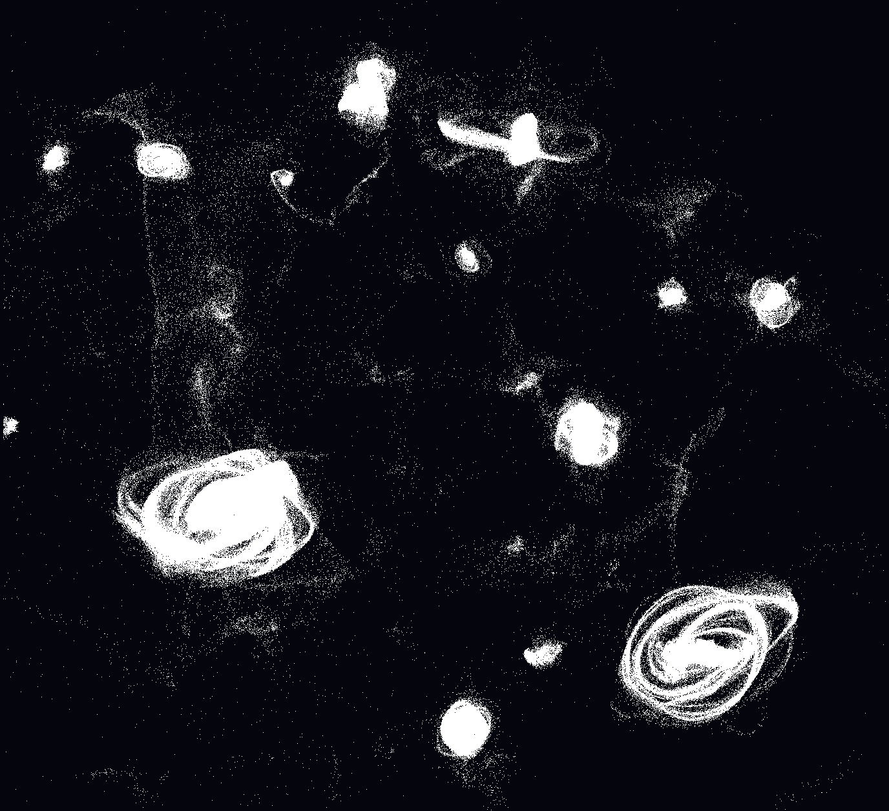

# mog-solver
[](https://www.youtube.com/watch?v=IXhZVVDpRts)
(click image for video)

A GPU-accelerated N-body gravity simulator using the **Mixture of Grids (MOG)** algorithm.

## The Algorithm

Traditional particle-mesh (PM) gravity solvers face a fundamental tradeoff: a single coarse grid is fast but produces blind spots (particles in the same cell exert no force on each other) and grid-aligned artifacts. A fine grid fixes this but memory and compute scale cubically with resolution prohibitive in 3D.

MOG solves this by averaging forces across an ensemble of independently rotated and offset coarse grids. Particles that share a cell on one grid are separated on others. The ensemble average recovers sub-cell force resolution and eliminates grid artifacts, at a fraction of the memory cost of an equivalent fine grid.

### Key insight

Think of two tic-tac-toe boards, one offset so its gridlines subdivide the other's cells. You have 18 real cells (2 × 3²) but effective sampling coverage of 36 (6²). Each additional grid multiplies effective resolution in each dimension but only adds linearly to memory.

In 3D with k grids of resolution g:

| Quantity | Expression | Example (k=240, g=16) |
|---|---|---|
| Real cells | k × g³ | 983,040 |
| Equivalent fine grid | (k × g)³ | 90.2 billion |
| Memory savings | k² | ~92,000× |

### Why rotations matter

Offsets alone still leave directional blind spots — diagonal particle pairs are harder to resolve than axis-aligned ones. Random rotations break this symmetry. Each grid samples a different orientation of space, so the ensemble force is isotropic and free of grid-aligned artifacts regardless of particle configuration.

## Pipeline

```
For each grid i in [0, k):
  1. Rotate + offset particle positions into grid i's local frame
  2. Scatter mass to nearest grid point (NGP, atomic add)
  3. FFT → multiply by Green's function → IFFT → force field
  4. Sample force at particle's local position
  5. Rotate force back to world space

Average forces across all k grids
Update velocities and positions (leapfrog integration)
```

## Results

MOG resolves ring and shell galaxy morphologies at scales well below a single coarse cell width. No grid-aligned artifacts are present despite each individual grid being only 16³.

See the accompanying paper for force accuracy measurements and memory scaling analysis.

## Requirements

- Python 3.8+
- OpenGL 4.6 capable GPU
- `numpy`, `moderngl`, `moderngl-window`, `pyyaml`

## Usage

```bash
pip install numpy moderngl moderngl-window pyyaml
python main.py
```

## Controls

| Key | Action |
|---|---|
| Mouse drag | Rotate camera |
| Scroll | Zoom |
| Space | Pause / resume |
| R | Reset particles (Perlin noise) |
| T | Reset as two colliding galaxies |
| 1 / 2 / 3 | Clustering presets |
| G | Toggle grid debug overlay |
| H | Toggle particle rendering |
| C | Toggle FFT / convolution solver |
| [ / ] | Decrease / increase timescale |
| \ | Reverse time |
| Q | Quit |

## Configuration

Edit `config.yaml`:

```yaml
n_grids: 240        # Number of grids in the ensemble
grid_size: 16       # Resolution per grid (16³)
world_size: 100.0   # Simulation domain size
num_particles: 1e6  # Particle count
G: 100.0            # Gravitational constant
dt: 0.00001         # Time step
solver: fft         # "fft" or "convolution"
damping: 0.999      # Velocity damping per step
```

## Complexity

| Approach | Memory | Time per step |
|---|---|---|
| Direct N-body | O(n) | O(n²) |
| Single PM grid | O(g³) | O(g³ log g) |
| MOG | O(k·g³) | O(n·k + k·g³ log g) |

## Citation

If you use this code, please cite the accompanying paper:

```
tbmo (2026). Mixture of Grids (MOG): A Linear-Scaling Particle-Mesh
Poisson Solver via Ensemble Grid Averaging. 
```
[here](paper.pdf)